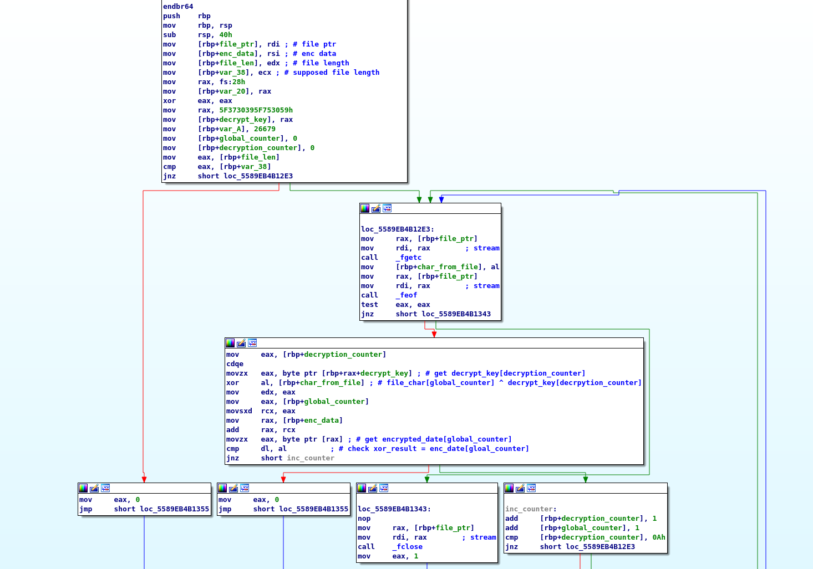

# Solution

We are provided with the file *bin_bin_bin* , lets
run `file` to check it 

```
$ file ./bin_bin_bin
ELF 64-bit LSB pie executable, x86-64, version 1 (SYSV), dynamically linked,  
interpreter /lib64/ld-linux-x86-64.so.2,for GNU/Linux 3.2.0, not stripped
```
Its a 64-bit ELF file and its not stripped which means that  
we get function names, lets open it in IDA to check  what the file does.
&nbsp;
&nbsp;


* __Initial Static Analysis__  

  __$ Anti-debuggin__
   
   

    This is the start of our `main` function, immediately we see a call to a  `antidebug`  
    function and than a check if its return value is 0 to determine execution flow, lets check  
    what the function does

   
  
   The function simply call ptrace with the _"traceme"_ value to check if the file is being  
   debbuged, to work around it we can manually set `eax` value to 0 after it preforms the `ptrace`  
   call, or to reverse the _jz_ --> _jzn_  
   
    __$ File handling__  
   
     

   The binary open a file called bin_bin that needs to be in the current directory and  
   than calls
   *  fseek -> set the pointer to the end of the file (2/SEEK_END)
   *  ftell  -> get the number of bytes from start to pointer (end of file) and pass it to var_13350
   *  fseek -> set the pointer to the start of the file (0/SEEK_SET)  
   also `cmp var_13354 , 0` will always result in true which will go to a path that  
   prints a message and exit, thats a check that always prevents execution so jmp must be reversed  

   
   __$ Validation__  
     
   I've modified some var names and and added comments to make the assembly easier  
   to read, there's a call to _memcpy_ to copy 78648 bytes from the data segment to 
   a diffrent location  
   (lets call the pointer to that address enc_data),now theres a call a function called `validate`  
   and if its return value is 0 than the validation succeeded, lets have a look at the vlidate function  
   
     
   
   Again i've added comments and changed var names to make it easier to follow, basically  
   thats a pseudo code of the function
   ```
   def validate(bin_bin , enc_data_cpy , file_len , num):

          if file_len != num:
              return 1 
          
          key = "h7_709_u0Y" # mind the order (big-endian so need to reverse this)
          for i in range(file_len):
                enc_data_cpy
              
   ```


