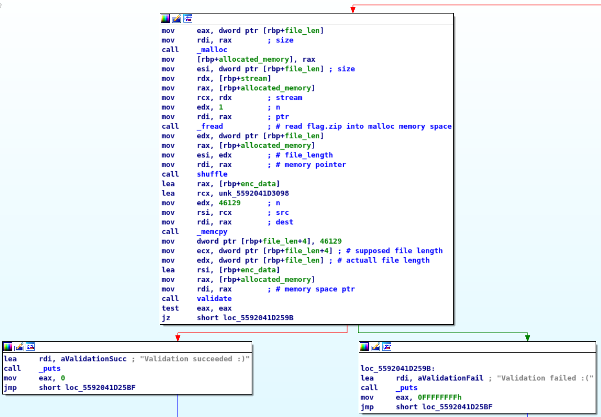
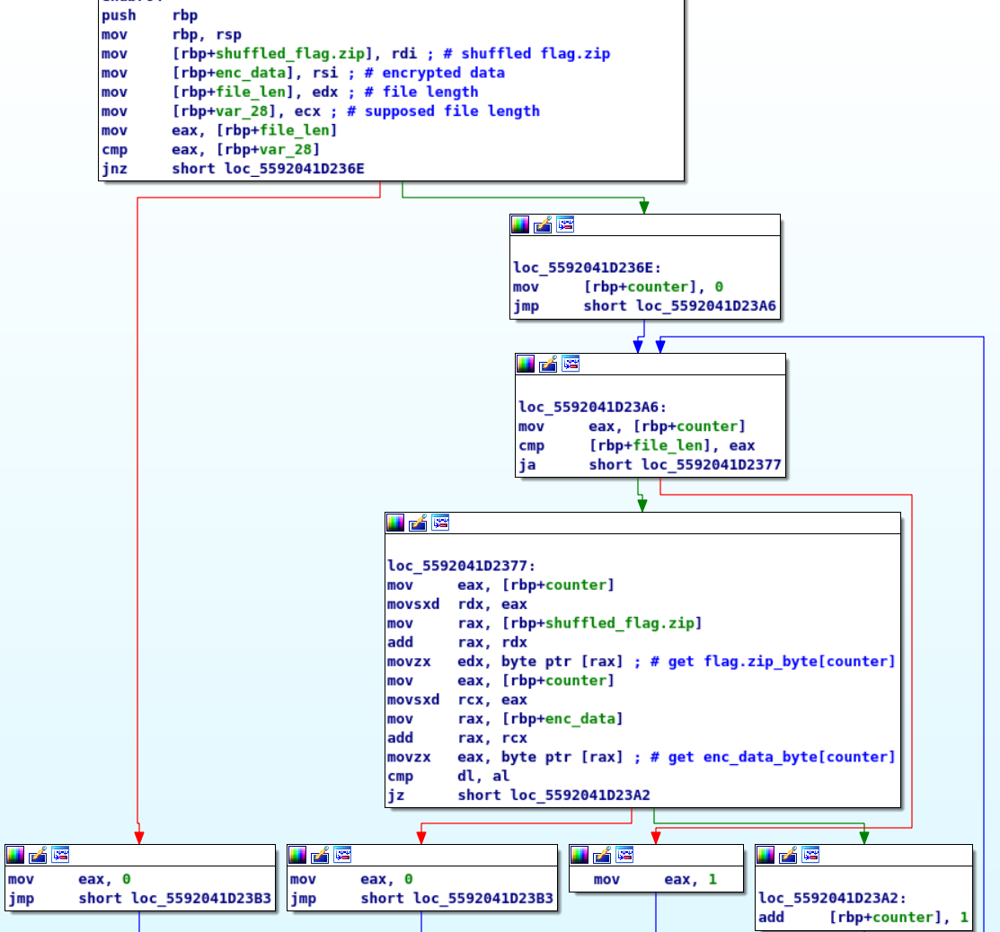

# Solution

We are provided with the file *bin_bin_bin* , lets
run `file` to check it 

```
$ file ./bin_bin_bin
ELF 64-bit LSB pie executable, x86-64, version 1 (SYSV), dynamically linked,  
interpreter /lib64/ld-linux-x86-64.so.2,for GNU/Linux 3.2.0, not stripped
```
Its a 64-bit ELF file and its not stripped which means that  
we get function names, lets open it in IDA to check  what the file does.
&nbsp;
&nbsp;


* __Initial Static Analysis__  

  __$ Anti-debuggin__
   
   

    This is the start of our `main` function, immediately we see a call to a  `antidebug`  
    function and than a check if its return value is 0 to determine execution flow, lets check  
    what the function does

   
  
   The function simply call ptrace with the _"traceme"_ value to check if the file is being  
   debbuged, to work around it we can manually set `eax` value to 0 after it preforms the `ptrace`  
   call, or to reverse the _jz_ --> _jzn_  
   
    __$ File handling__  
   
     

   The binary open a file called bin_bin that needs to be in the current directory and  
   than calls
   *  fseek -> set the pointer to the end of the file (2/SEEK_END)
   *  ftell  -> get the number of bytes from start to pointer (end of file) and pass it to var_13350
   *  fseek -> set the pointer to the start of the file (0/SEEK_SET)  
   also `cmp var_13354 , 0` will always result in true which will go to a path that  
   prints a message and exit, thats a check that always prevents execution so jmp must be reversed  

   
   __$ Validation__  
     
   I've modified some var names and and added comments to make the assembly easier  
   to read, there's a call to _memcpy_ to copy 78648 bytes from the data segment to 
   a diffrent location  
   (lets call the pointer to that address enc_data),now theres a call a function called `validate`  
   and if its return value is 0 than the validation succeeded, lets have a look at the vlidate function  
   
     
   
   Again i've added comments and changed var names to make it easier to follow, basically  
   thats a pseudo code of the function
   ```
   def validate(bin_bin , enc_data , file_len , num):

          if file_len != num:
              return 1 
          
          key = "h7_709_u0Y" # mind the order (big-endian so need to reverse this)
          for i in range(file_len):
                if (enc_data[i] ^ key[0 till 9] != bin_bin[i] ):
                      return 1
              
   ```
   In order to solve it we will need export the memory dump from IDA (78648 bytes from  
   the starting address) into a file called _bbbdump_
   ```
   # snippet of the dump format 
   26 75 39 19 3b 31 36 5f 37 68 59 30 75 5f 39 30 
   34 5f 9 68 58 30 75 5f 99 21 37 5f 37 68 59 30
   35 5f 39 30 37 5f 37 68 21 1b 74 5f 39 30 37 5f
   37 68 59 30 35 5f 1 30 3a 5f 77 68 46 30 6b 5f
   3f 30 37 5f 33 68 59 30 35 5f 39 30 37 5f 37 68 
   19 30 75 5f 39 30 37 5f 77 68 59 30 75 5f 39 30 
   ef 5d 37 68 59 30 75 5f e1 32 37 5f 37 68 59 30 

   ```  
   __$ Reversing the Validation__

   ```python

   """
   The validate function check for ->
        bin_bin_byte[index] ^ key[key_index] = enc_data[index]

   since xor is reverseable than ->
        enc_data[index] ^ key[key_index] = bin_bin_byte[index]

  that way we can get the file that can pass the validate function
  """

  key_counter = 0 # 0 ---- > 9  
  decryption_key = [0x59 , 0x30, 0x75, 0x5F, 0x39, 0x30, 0x37, 0x5F, 0x37, 0x68]


  # Create bin_bin file
  with open('../mem_dumps/bbbdump') as f , open('bin_bin' , 'wb') as out:
    
    # loop through the encrypted data
    for line in f:
      
      # create an array for the correct hex values
        bytes_output = []
        for hex_byte in line.split():

          # check for key index reset       
          if key_counter == 10:
              key_counter = 0
          
          # xor values to get the valid one
          correct_byte = int(hex_byte,16) ^ decryption_key[key_counter]
          bytes_output.append(correct_byte)
          key_counter +=1
        
        out.write(bytes(bytes_output))
            
   ```
&nbsp;
* __bin_bin Analysis__  

  I've run `file` on it and got the same result as earlier, this is a 64-bit  
  not stripped ELF file as well  
  
  ```
  $ file ./bin_bin
  ELF 64-bit LSB pie executable, x86-64, version 1 (SYSV), dynamically linked, 
  interpreter /lib64/ld-linux-x86-64.so.2, for GNU/Linux 3.2.0, not stripped
  ```  
  I've opened the file in IDA and its the same as _bin_bin_bin_ and the only  
  thing changed is the mem_dump bytes and the bytes of the key so i've modified  
  the values in the script to generate the next binary file called _"bin"_
  ```python
  key_counter = 0 # 0 ---- > 9  
  decryption_key = [0x33 , 0x5F, 0x50, 0x61, 0x35, 0x35, 0x77, 0x30, 0x52, 0x44]


  # Create bin_bin file
  with open('../mem_dumps/bbdump') as f , open('bin' , 'wb') as out:

    # loop through the encrypted data
    for line in f:
      
      # build correct hex values for each line grabbed
        byte_output = []
        for hex_byte in line.split():
          
          # check for reset on key_counter
          if key_counter == 10:
              key_counter = 0

          correct_byte = int(hex_byte,16) ^ decryption_key[key_counter]
          byte_output.append(correct_byte)
          key_counter +=1
        
        out.write(bytes(byte_output))
  ```  
  &nbsp;
* __bin Analysis__  
  
  its a 64-bit not stripped ELF file as well  
  
  ```
  $ file ./bin
  ELF 64-bit LSB pie executable, x86-64, version 1 (SYSV), dynamically linked,
  interpreter /lib64/ld-linux-x86-64.so.2, for GNU/Linux 3.2.0, not stripped
  ```  
  It follows the same anti debugging, file handling (insted of bin/bin_bin it  
  tries to open _"flag.zip"_) and  control flow (cmp that prevernt execution)  
  as the previous  bin_bin_bin && bin_bin, although it handles the validation diffrently  
  (added comments && changed var names to easier read)  
    
  so this is the flow of this validation section  
  * malloc   -> allocate space (the size of bytes returned by ftell on "flag.zip")  
  * fread    -> read the bytes from flag.zip into the newly created heap memory from malloc  
  * shuffle  -> in-depth look later  
  * memcpy   -> essentially copying the encrypted bytes from the data section  
  * validate -> in depth look later  
  &nbsp;  
  
  lets understand the `shuffle` function, it takes the file_length and the adress to  
  the allocated memory (essentially the bytes of flag.zip) as arguments through rdi & esi  
    
  I've left comments on the assembly instruction that modified values to have full
  understanding on what  
  the algorithem does, but on the high level thats the pseudo code  
  ```
  shuffle(file_len , mem_ptr) {
    
    // initialize C rand() func with the seed value 0x1337 
    srand(0x1337)

    // loop through the flag.zip bytes
    for ( i in range(file_len)) {
      
      // shuffle values 
      swap(mem_ptr[i] , mem_ptr[rand() % (i+1)])
       
    }
  }
  ```
  they are using a swap function which they created  
    
  the function grab the byte pointed by rdi(first argument) and save it in a a diffrent location  
  i called _mem_ptr_byte_ (essentially storing in tmp var), than grab the byte pointed by  
  rsi(second argument , in this case its the flag.zip[rand() % (loop_index + 1)]) and `mov` its  
  value into the address pointed by rdi, and than go the the address pointed by rsi and `mov` the  
  value from our "tmp" into there, so its an actuall swap function  

  ```
  # pseudo code for swap
  swap(arr[first_index] , arr[second_index]){
    tmp = arr[first_index]
    arr[first_index] = arr[second_index]
    arr[second_index] = tmp
  }
  ```
  So all they do is take the bytes from our created "flag.zip" file and rearrange the  
  bytes by swapping it using the C rand() function which they initialize with a hardcoded  
  seed everytime, since the rand() function is actually a pseudo-random number generator  
  and we have the seed they used we can predict the rand() output (assuming we are using the  
  same implementation of rand(), which will 100% be the same if we use the same version of libc  
  they used to create the obfuscated memory dump).  
  &nbsp;  

  Finally lets check what the `validate` function does  
    
  Its the same validate as before but without xoring values with a key, which mean  
  we cmp each byte from the shuffled flag.zip[index] with the encrypted_memory[index]  
  and if its the same we pass the validation.  

   __$ Reversing the shuffle function__  
   We have the enc_data which is the output of the original data (what should be flag.zip)  
   after it was swapped by the shuffle algorithem, if we will manage to reverse the swaps  
   on the enc_data we will get the original file that can pass the `validate` check.  
   
* __index mapping logic__  
  ```
   # why cant we use the same shuffle to retrive the original
   we need to understand how the swap will rotate our indexes,  
   since the swap may occuer more than once for a given index(since  
   we swapping *array size* times and not *array size / 2* &&  
   rand()%(i+1) may produce identical outputs for diffrent i values  
   (given the rand() will generate a diffrent result from previous rounds)  
   resulting in swapping the same index more than once) for example:
   
   index_array  = [0,1,2,3,4,5,6,7]
   rotate index like so:
   0 --> 4 --> 7 
	 index 0 swapped with index 4,
	 index 4 swapped with index 7.
	 index_array_shuffled = [4,1,2,3,7,5,6,0] 

   since value at index 4 moved more than once, simply 
	 applying the shuffle algorithem wont reverse the algorithem.

   # solution vector 
	 what we can do is create a mapping for index swaps.
	 create index_arr and pass it through the shffule so: starting_index -> final_index
	 for example:
	   
	 arr = [ 'a' , 'b' , 'c' , 'd' , 'e' , f' ,'g' , 'h' ]
	 swap index 0 --> 4 --> 7 
	 shuffled_arr = [ 'e' , 'b' , 'c' , 'd' , 'h' , 'f' , 'g' 'e']
	   
	 index_arr = [ 0 , 1 , 2 , 3 , 4 , 5 , 6 , 7 ] 
	 shuffle index_arr under our algorithem
	 index_arr_shuffled = [4 , 1 , 2 , 3 , 7 , 5 ,  6 , 0 ]

   Now using the index_arr_shuffled mapping we can retrive the original
   array from the shuffled one ( for example the first value on our shuffled array
   should be according to the index_arr_shuffled on the fourth position, which is the 
   actuall valid position)

   # generic mapping  
	 for ( i = 0; i < len(shuffled_arr); i++ ) {
	      shuffled_arr[i]  =  shuffled_arr[index_arr_shuffled[i]]
	 }
  
  ```
  lets write the final code to retrive the flag.zip from the obfuscated memory dump  
  (insted of using the dump file I've used it as an array and called it "mem_dump"  
  in my c file, since its 46129 bytes long i didnt include it in this source code  
  but it will be included in "mem_dumps" folder as "bdump" for you to copy and use)

  ```C 
  int main(){ 
   
  /* Intializing rand with static seed */
  srand(0x1337u);
    
	/* Intializing index array */
	int index_arr[46129];
	for (size_t i=0; i<46129; i++){
		index_arr[i] = i;
	}

	/* Swapping indexes for later mapping */
	for (size_t i=46129-1; i>0; i--){
		int rnd_val = rand() % (i+1);
		int tmp = index_arr[i];
		index_arr[i] = index_arr[rnd_val];
		index_arr[rnd_val] = tmp;	
	}

	/* Creare copy of the memory dump for reference */
	unsigned char mem_dump_cpy[46129];
	for (size_t i=0; i<46129; i++){
		mem_dump_cpy[i] = mem_dump[i];
	}

	/* Reverse the swap */
	for (size_t i=0; i<46129; i++){
		mem_dump[index_arr[i]] = mem_dump_cpy[i];
	}

	/* Write byte array to file */
	FILE *fp = fopen("flag.zip" , "wb");
	fwrite(mem_dump, 1 , sizeof(mem_dump), fp);
	fclose(fp);


  return(0);
}
  
  ```
  thats it.


   

    


  
 


