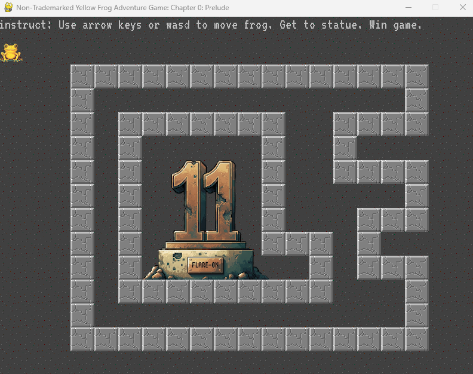

# Flare-On 11 challenge 1: frog

This Challange We are faced with a 
basic file tree for a pygame application  

* frog.exe &rarr; frog.py compiled
* frog.py  &rarr; source code  
* fonts/   &rarr; game assets  
* img/     &rarr; game assets  
* README &rarr; installation instructions  

Runing the game we are greeted by a little frog maze, the frog  
is located at the top left corner and we are prompted to  
_"Get to statue. Win game"_

  
  
  We are blocked by those grey blocks so we cant reach the statue.  
  having a look at the source code we can immediately see a flag function  
  ```python
  def GenerateFlagText(x, y):
    key = x + y*20
    encoded = "\xa5\xb7\xbe\xb1\xbd\xbf\xb7\x8d\xa6\xbd\x8d\xe3\xe3\x92\xb4\xbe\xb3\xa0\xb7\xff\xbd\xbc\xfc\xb1\xbd\xbf"
    return ''.join([chr(ord(c) ^ key) for c in encoded])
  ```  

  All we need to do is to check for _Xrefs_ to figure out the `x,y` arguments  
```python  
  if not victory_mode:
            # are they on the victory tile? if so do victory
            if player.x == victory_tile.x and player.y == victory_tile.y:
                victory_mode = True
                flag_text = GenerateFlagText(player.x, player.y)
                flag_text_surface = flagfont.render(flag_text, False, pygame.Color('black'))
                print("%s" % flag_text)
  ```

Checking the `victory_tile.x,y` definitions, we get that they both are equal to 10, so now  
we basically have all we need to solve it and get the flag  

## Solution  

We can just copy paste the flag generating function and print the string  

```python
def GenerateFlagText(x, y):
  key = x + y*20
  encoded = "\xa5\xb7\xbe\xb1\xbd\xbf\xb7\x8d\xa6\xbd\x8d\xe3\xe3\x92\xb4\xbe\xb3\xa0\xb7\xff\xbd\xbc\xfc\xb1\xbd\xbf"
  return ''.join([chr(ord(c) ^ key) for c in encoded])

if __name__ == "__main__":
  print(GenerateFlagText(10,10))
  
```  
Flag: welcome_to_11@flare-on.com
