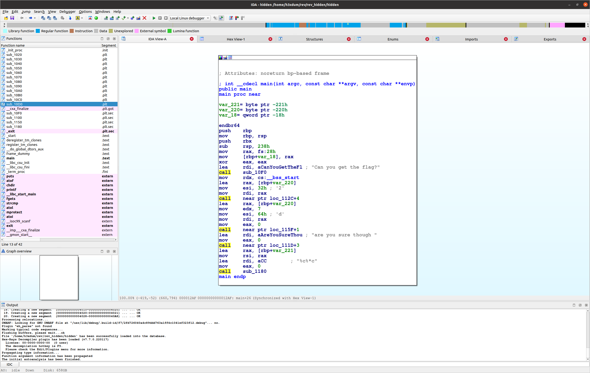
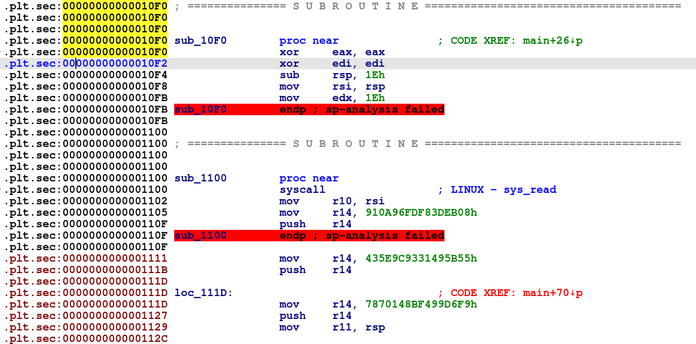

# Solution


___We are provied with an executable file called "hidden" , lets  
run  `file` to check it___

```
$ file ./hidden
ELF 64-bit LSB shared object, x86-64,version 1 (SYSV), dynamically linked,
interpreter /lib64/ld-linux-x86-64.so.2, BuildID[sha1]=f72fd726040a4c89ddd763a1ff4c1041ef323f12, 
for GNU/Linux 3.2.0, not stripped
```
&nbsp;  
___Its a 64-bit not stripped ELF file which means we have  
Symbols to work with, lets run the binary___  
```
$ ./hidden
testpass123
fail!
```
___All we get is an input prompt (which we filled with "testpass123")  
and a "fail" message, which is not that useful but "fail" can be used  
as a Xref to traverse execution path if necessary and the string is not being built at runtime.  
Lets open the binary in IDA to check whats going on___  



___Looking at "main" disassembly we can see there are a few function calls  
but its looking werid for few reasons:___  
*   Binary isnt stripped but function names are sub_xxx
*   Previously running we didnt get the "can you get the flag" message
*   fgets is being  dynamically linked but we dont see a clear call to it  

___lets check the first function call to ```sub_10F0``` which look like  
a typical ```puts```  call, but we obviously know its not so it does  
look like a good place to start at since its a werid behavior and  
we are shown with a "can you get the flag" message___


 
 ___First we see "edi" is being cleared so its confirmed that the function doesnt have  
 anything to do with printing the message, we do see a syscall to ```sys_read``` which  
 is  logiical because its probably where we were prompted for input while previously running  the program, next we can see that 3 strings are being pushed to the stack (they are not a valid ascii values so whatever in there will probably get deobfuscated) now ___