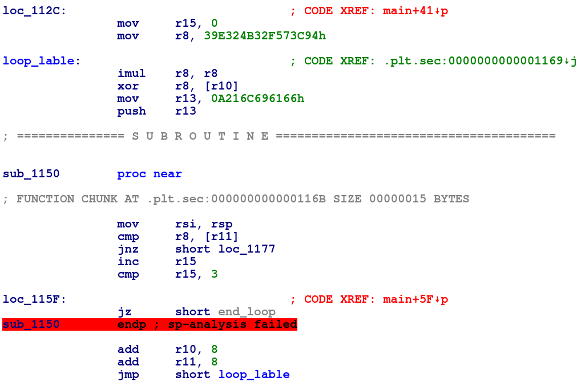

# Solution


___We are provied with an executable file called "hidden" , lets  
run  `file` to check it___

```
$ file ./hidden
ELF 64-bit LSB shared object, x86-64,version 1 (SYSV), dynamically linked,
interpreter /lib64/ld-linux-x86-64.so.2, BuildID[sha1]=f72fd726040a4c89ddd763a1ff4c1041ef323f12, 
for GNU/Linux 3.2.0, not stripped
```
&nbsp;  
___Its a 64-bit not stripped ELF file which means we have  
Symbols to work with, lets run the binary___  
```
$ ./hidden
testpass123
fail!
```
___All we get is an input prompt (which we filled with "testpass123")  
and a "fail" message, which is not that useful but "fail" can be used  
as a Xref to traverse execution path if necessary and the string is not being built at runtime.  
Lets open the binary in IDA to check whats going on___  


___Looking at "main" disassembly we can see there are a few function calls  
but its looking werid for few reasons:___  
*   Binary isnt stripped but function names are sub_xxx
*   Previously running we didnt get the "can you get the flag" message
*   fgets is being  dynamically linked but we dont see a clear call to it  

___lets check the first function call to ```sub_10F0``` which look like  
a typical ```puts```  call, but we obviously know its not so it does  
look like a good place to start at since its a werid behavior and  
we are shown with a "can you get the flag" message___


 
 ___First we see "edi" is being cleared so its confirmed that the function doesnt have  
 anything to do with printing the message, we do see a syscall to ```sys_read``` which  
 is  logiical because its probably where we were prompted for input while previously running  the program, next we can see that 3 strings are being pushed to the stack (they are not a valid ascii values so whatever in there will probably get deobfuscated) and "r11" get the value of rsp to be able to point to the newly created stack frame that hold the obfuscated string___

 

___Here we see the actual deobfuscation logic___  
* A value is being set into "r8" -> [key] & "r15" -> [counter]
* A loop start with this pseudo code:
    ```
    loop 3 times:
        imul the key;
        xor key , our_input [8 bytes every round]
        cmp  xor'ed_key , stack_string [8 bytes every round]
    
    # pushed the string "fail" to the stack every round
    ```
___since we know that xor is reversable which means that :___   

key ^ our_input = stack_string  
= =  
our_input = key ^ stack_string  

___So in order to deobfuscate each of the 3 string we need to___  
*   ___xor key , stack_string ---> result in the first 8 bytes of our input___  
*   ___Imul corresponding correct key --->  result in correct next input___
*   ___repeat the length of the stack string___  
&nbsp;
## Finding the flag
___We can either solve it dynamically with a debugger and  
finding the correct 8 bytes of the key every time then  killing  
the proccess & repeating, in this case it wont take long because  
the key is only 24 bytes but i wrote a script to statically reverse  
the algorithme no matter the key length___
```python
from pwn import *


# Date statically gathered 
stack_strings = [0x7870148BF499D6F9 , 0x435E9C9331495B55, 0x910A96FDF83DEB08 ]
hard_coded_value = 0x39E324B32F573C94 
flag = ""

def imul(hex_data):
    hex_data = hex_data * hex_data
    hex_data = hex_data & 0xFFFFFFFFFFFFFFFF
    return hex_data

# Initializing data 
hard_coded_value = imul(hard_coded_value)
tmp = hard_coded_value
hard_coded_value = tmp ^ stack_strings[0]

# Convert to little endian & push the flag
flag += (p64(hard_coded_value , endian = 'little')).decode() 


for i in range(1 , 3):

    # setting next value 
    hard_coded_value = tmp ^ hard_coded_value
    
    # imul and clean it 
    hard_coded_value = imul(hard_coded_value)
    tmp = hard_coded_value 

    # pushing the flag 
    hard_coded_value = hard_coded_value ^ stack_strings[i]
    flag += (p64(hard_coded_value , endian = 'little')).decode()    
    
print(flag)    

#ictf{h1ddenc0de_1a29d3}       
```